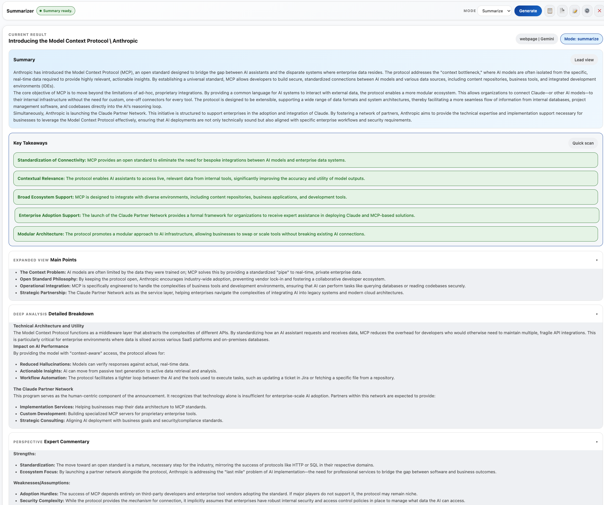

# Lightweight Summarizer

Browser extension for summarizing YouTube videos, webpages, selected text, and course lesson content with Gemini, OpenAI, or a local LLM endpoint.

Supports Chrome and Firefox with browser-specific manifests:

- `manifest.chrome.json`
- `manifest.firefox.json`

## User Overview

- Summarizes YouTube watch/live pages from transcript data
- Summarizes webpages from semantic-first extraction with accessibility-tree fallback
- Summarizes highlighted text when the user has a selection
- Summarizes course lessons:
  - Udemy lesson pages
  - Coursera lesson and supplement pages
- Supports follow-up Q&A using the saved summary plus prior conversation history
- Exports summaries as Markdown or plain text
- Logs extraction, provider requests, and provider responses to the console for debugging

## Example Output

## Supported Providers

- `gemini`
- `openai`
- `local`

The `local` provider supports a configurable OpenAI-compatible or Ollama-style endpoint through settings in [lib/storage.js](/lib/storage.js).

## Current Summary Behavior

- Side panel is the primary UI
- Results are stored per tab
- Closing a tab clears that tab's saved result and workflow state
- Normal YouTube summaries use 1 provider request
- Long YouTube transcripts can use up to 4 provider requests total
- Normal webpages should usually use 1 provider request
- Streaming summary mode has been removed

## User Docs

- [User Guide](docs/USER_GUIDE.md)
- [Setup](docs/SETUP.md)

## Developer Docs

**Getting Started:**
- [Contributing Guide](docs/CONTRIBUTING.md) - Setup, local development, and code standards
- [Architecture](docs/ARCHITECTURE.md) - System design and module organization

**Core Concepts:**
- [Workflow](docs/WORKFLOW.md) - Data flow from extraction to rendering
- [CONTENT_PIPELINE.md](docs/CONTENT_PIPELINE.md) - How content extraction works
- [API](docs/API.md) - Message types and internal data structures
- [Prompts](docs/PROMPTS.md) - Prompt system and template specifications

**Maintenance & Operations:**
- [Maintenance Guide](docs/MAINTENANCE.md) - Common maintenance tasks and workflows
- [Debugging Guide](docs/DEBUGGING.md) - Troubleshooting and debugging techniques
- [Testing Guide](docs/TESTING.md) - Running tests and test coverage
- [Troubleshooting](docs/TROUBLESHOOTING.md) - Solutions to common issues

**Reference:**
- [Storage & Settings](docs/STORAGE.md) - Data persistence and configuration
- [Providers](docs/PROVIDERS.md) - LLM provider implementations
- [UI Documentation](docs/UI.md) - UI components and styling

## Current Architecture

The codebase is split into small modules instead of monolithic extractor or prompt files.

- Content extraction:
  - [lib/extractors.js](/lib/extractors.js)
  - [lib/extractors/core.js](/lib/extractors/core.js)
  - [lib/extractors/accessibility-tree.js](/lib/extractors/accessibility-tree.js)
  - [lib/extractors/youtube.js](/lib/extractors/youtube.js)
  - [lib/extractors/webpage.js](/lib/extractors/webpage.js)
  - [lib/extractors/course.js](/lib/extractors/course.js)
  - [lib/extractors/selected-text.js](/lib/extractors/selected-text.js)
- Prompt building:
  - [lib/prompts/builders.js](/lib/prompts/builders.js)
  - [lib/prompts/common.js](/lib/prompts/common.js)
  - [lib/prompts/templates/](/lib/prompts/templates)
- Background orchestration:
  - [background.js](/background.js)
  - [lib/background/tab-manager.js](/lib/background/tab-manager.js)
  - [lib/background/summary-service.js](/lib/background/summary-service.js)
  - [lib/background/ui-notifier.js](/lib/background/ui-notifier.js)
- Side panel UI:
  - [sidepanel.js](/sidepanel.js)
  - [lib/sidepanel/state.js](/lib/sidepanel/state.js)
  - [lib/sidepanel/render.js](/lib/sidepanel/render.js)

## Load Locally

Chrome:

1. Run `./scripts/use-chrome-manifest.sh`
2. Open `chrome://extensions/`
3. Enable Developer mode
4. Click Load unpacked
5. Select this project folder

Firefox:

1. Run `./scripts/use-firefox-manifest.sh`
2. Open `about:debugging#/runtime/this-firefox`
3. Click `Load Temporary Add-on...`
4. Select this project's `manifest.json`

## Developer Quick Start

New to the codebase? Follow this path:

1. **Understand the project:** Read [Architecture](docs/ARCHITECTURE.md)
2. **Set up locally:** Follow [Contributing Guide](docs/CONTRIBUTING.md)
3. **Learn the data flow:** Review [Workflow](docs/WORKFLOW.md)
4. **Explore the modules:** Start with [lib/extractors.js](/lib/extractors.js)
5. **Make a change:** See [Contributing Guide](docs/CONTRIBUTING.md#making-changes)
6. **Debug your changes:** Use [Debugging Guide](docs/DEBUGGING.md)

## Notes

- Coursera lesson pages use the dedicated course extraction route instead of generic webpage extraction.
- The side panel is the primary UI. The floating UI is optional and controlled by settings.
- Summary streaming is not used. The extension uses blocking summary generation only.
- Debug payloads are logged to the console instead of being rendered in the side panel.
