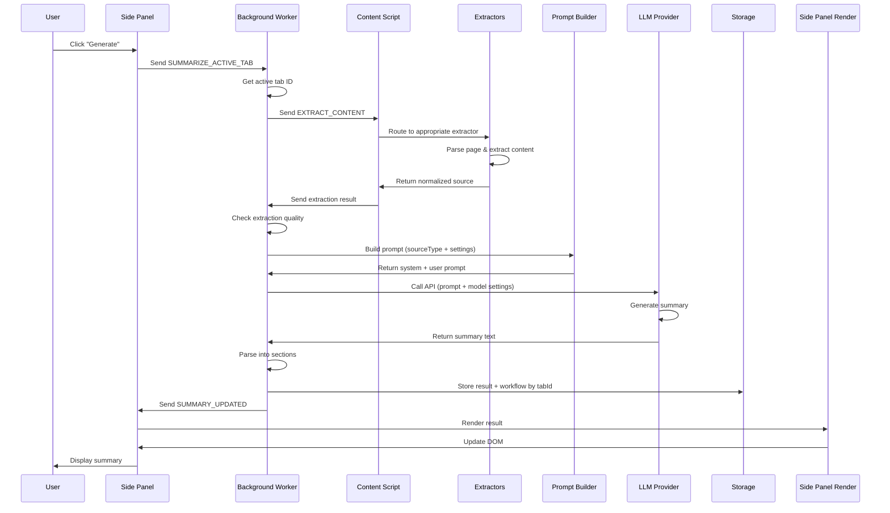
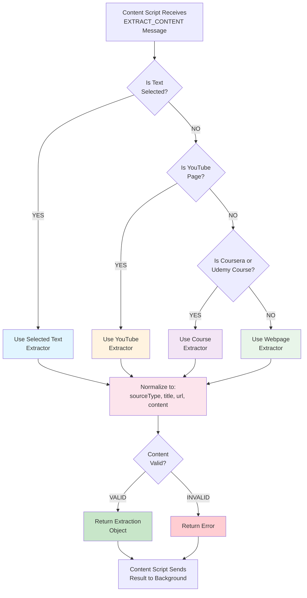
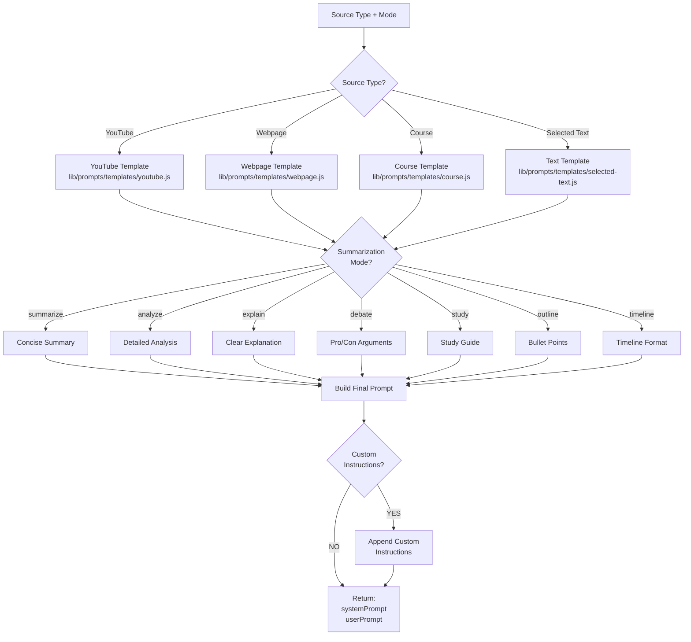
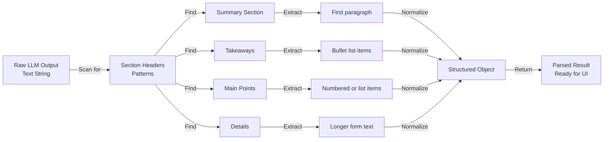

# Content To Summary Pipeline

This document explains how the extension retrieves source content before summarization, what gets sent to providers, and how the current request strategy behaves by source type.

## Primary Files

- [content.js](/content.js)
- [lib/extractors.js](/lib/extractors.js)
- [lib/extractors/core.js](/lib/extractors/core.js)
- [lib/extractors/accessibility-tree.js](/lib/extractors/accessibility-tree.js)
- [lib/extractors/webpage.js](/lib/extractors/webpage.js)
- [lib/extractors/youtube.js](/lib/extractors/youtube.js)
- [lib/extractors/course.js](/lib/extractors/course.js)
- [lib/background/tab-manager.js](/lib/background/tab-manager.js)
- [lib/background/summary-service.js](/lib/background/summary-service.js)
- [lib/provider-registry.js](/lib/provider-registry.js)
- [lib/debug.js](/lib/debug.js)
- [lib/prompts/builders.js](/lib/prompts/builders.js)

## End-To-End Flow

### High-Level Sequence



### Detailed Step-By-Step Process

#### **Step 1: User Interaction**
User clicks the "Generate" button in the side panel.

**What happens:**
- Button click triggers message send
- Side panel reads current mode from selector
- Message payload: `{ type: 'SUMMARIZE_ACTIVE_TAB', mode: 'summarize' }`

#### **Step 2: Route to Background Worker**
Side panel sends message to background worker using Chrome extension messaging.

**File:** [sidepanel.js](/sidepanel.js)

**What happens:**
```js
chrome.runtime.sendMessage({
  type: 'SUMMARIZE_ACTIVE_TAB',
  mode: document.getElementById('panel-mode').value
}, (response) => {
  // Handle response
});
```

#### **Step 3: Background Worker Receives Request**
Background worker receives `SUMMARIZE_ACTIVE_TAB` message.

**File:** [background.js](/background.js)

**What happens:**
- Identify active tab using `chrome.tabs.query()`
- Check if tab has prior result in storage
- If yes, optionally skip extraction (use cached extraction)
- Validate tab ID is valid
- Log: `[Summarizer] Workflow: Starting summary for tab X`

#### **Step 4: Extract Content from Page**
Background worker sends `EXTRACT_CONTENT` message to content script on active tab.

**File:** [lib/background/tab-manager.js](/lib/background/tab-manager.js)

**What happens:**
- Inject content script if not already present
- Send `EXTRACT_CONTENT` message
- Wait for extraction result with timeout

**Message sent:**
```js
{
  type: 'EXTRACT_CONTENT',
  // No additional data needed - content script knows its own page
}
```

**Log:** `[Summarizer] Extraction: Requesting content from tab X`

#### **Step 5: Content Script Routes to Extractor**
Content script receives message and determines which extractor to use.

**File:** [content.js](/content.js) → [lib/extractors.js](/lib/extractors.js)

**Extraction order:**
1. Check if user has highlighted text → use `selectedText` extractor
2. Check if YouTube watch/live page → use `youtube` extractor
3. Check if Coursera/Udemy course page → use `course` extractor
4. Otherwise → use `webpage` extractor

**Log:** `[Summarizer] Extraction: Detected [type] page`

#### **Step 6: Extractor Processes Content**
Chosen extractor retrieves and normalizes page content.

**Three parallel enrichment tracks:**

**For YouTube:**
- Read video metadata (title, duration, views, channel)
- Fetch caption tracks from YouTube API
- Parse transcript with timestamps
- Extract video description and chapters

**For Webpages:**
- Clone and clean DOM (remove nav, ads, etc.)
- Extract semantic content
- Score content blocks by relevance
- Fallback to accessibility tree if needed

**For Courses:**
- Wait for lesson content to load
- Extract transcript/reading material
- Clean and format content
- Handle platform-specific layouts

**For Selected Text:**
- Get user's current selection
- Return as-is (minimal processing)

**Returns normalized object:**
```js
{
  sourceType: "youtube|webpage|course|selectedText",
  title: "Page or Video Title",
  url: "https://...",
  content: "Full text content here...",
  // Optional rich fields:
  contentRaw: "Raw unprocessed content",
  transcriptSegments: [{text, startSeconds, startLabel}],
  videoDetails: {duration, views, channel, publishDate}
}
```

**Log examples:**
- `[Summarizer] Extraction: Found 2500 tokens of transcript`
- `[Summarizer] Extraction: Extracted 1200 tokens from webpage`

#### **Step 7: Content Script Returns to Background**
Content script sends extraction result back through Chrome messaging.

**File:** [content.js](/content.js)

**Data sent:**
```js
chrome.runtime.sendMessage({
  type: 'EXTRACTION_RESULT',
  extraction: {
    sourceType: "youtube",
    title: "....",
    content: "...."
  }
});
```

#### **Step 8: Background Validates Extraction**
Background worker receives extraction result and validates quality.

**File:** [lib/background/summary-service.js](/lib/background/summary-service.js)

**Validation checks:**
- ✓ Content is not empty
- ✓ Content length > minimum threshold
- ✓ Source type is recognized
- ✓ Title exists

**If validation fails:**
- Log error: `[Summarizer] Provider: Error: Could not extract content`
- Send error to UI
- Stop workflow

**Log:** `[Summarizer] Extraction: Validation passed (2500 tokens)`

#### **Step 9: Build Prompt**
Background worker assembles the prompt based on content and settings.

**File:** [lib/prompts/builders.js](/lib/prompts/builders.js)

**Inputs:**
- `sourceType` (determines template)
- Extracted `content`
- User-selected `mode` (Summarize, Analyze, Explain, etc.)
- Custom instructions from settings
- Provider max tokens

**Template selection:**
```js
// Switch based on sourceType
if (sourceType === 'youtube') {
  template = youtubeTemplate;
} else if (sourceType === 'webpage') {
  template = webpageTemplate;
} else if (sourceType === 'course') {
  template = courseTemplate;
} else {
  template = defaultTemplate;
}
```

**Built prompt has:**
```js
{
  systemPrompt: "You are a helpful summarizer...",
  userPrompt: "Summarize the following [courseType]:\n\n[content]",
  model: "gemini-pro", // or gpt-3.5-turbo
  maxTokens: 500,
  temperature: 0.7
}
```

**Log:**
- `[Summarizer] Provider: System prompt length: 250 tokens`
- `[Summarizer] Provider: User prompt length: 2500 tokens`

#### **Step 10: Call LLM Provider API**
Background worker calls the selected LLM provider with the prompt.

**File:** [lib/provider-registry.js](/lib/provider-registry.js)

**Provider routes:**
- If provider = "gemini" → call [lib/providers/gemini.js](/lib/providers/gemini.js)
- If provider = "openai" → call [lib/providers/openai.js](/lib/providers/openai.js)
- If provider = "local" → call [lib/providers/local.js](/lib/providers/local.js) or [lib/providers/ollama.js](/lib/providers/ollama.js)

**API call example (Gemini):**
```js
const response = await fetch('https://generativelanguage.googleapis.com/v1beta/models/gemini-pro:generateContent', {
  method: 'POST',
  headers: {
    'Content-Type': 'application/json',
    'x-goog-api-key': API_KEY
  },
  body: JSON.stringify({
    contents: [{
      parts: [{text: userPrompt}],
      role: 'user'
    }],
    system_instruction: {text: systemPrompt}
  })
});
```

**Log:**
- `[Summarizer] Provider: Calling Gemini API...`
- `[Summarizer] Provider: Request method: POST to https://...`
- `[Summarizer] Provider: Sending [3000] total tokens`

#### **Step 11: Provider Generates Summary**
LLM processes prompt and generates summary.

**Provider response:**
```json
{
  "candidates": [{
    "content": {
      "parts": [{
        "text": "This video discusses...\n\nKey Points:\n- Point 1\n- Point 2"
      }]
    }
  }]
}
```

**What LLM does:**
1. Analyzes content for key themes
2. Extracts main points
3. Generates takeaways
4. Structures output based on mode (bullet points for Outline, narrative for Summarize, etc.)

**HTTP Response time:** typically 2-10 seconds depending on content length

**Log:**
- `[Summarizer] Provider: Response received (200 OK)`
- `[Summarizer] Provider: Response text length: 450 tokens`

#### **Step 12: Parse Response into Sections**
Background worker parses LLM response into structured sections.

**File:** [lib/cleaners.js](/lib/cleaners.js)

**Parser identifies sections by scanning for patterns:**

```
Summary: [extract first paragraph]
Key Takeaways:
- [extract list items]
Main Points:
- [extract list items]
Detailed Breakdown:
[extract content]
```

**Parsed object:**
```js
{
  summary: "Full paragraph summary",
  keyTakeaways: ["Takeaway 1", "Takeaway 2"],
  mainPoints: ["Point 1", "Point 2"],
  detailedBreakdown: "Long form breakdown",
  expertCommentary: "Additional insights",
  followUpQuestions: ["Question 1", "Question 2"]
}
```

**Log:** `[Summarizer] Storage: Parsed 6 sections from response`

#### **Step 13: Store Complete Result**
Background worker stores result and metadata by tab ID.

**File:** [lib/background/tab-manager.js](/lib/background/tab-manager.js), [lib/storage.js](/lib/storage.js)

**Stored in Chrome storage:**
```js
chrome.storage.local.set({
  [`tab_${tabId}`]: {
    title: "Video Title",
    timestamp: 1712973600000,
    sourceType: "youtube",
    providerLabel: "Gemini",
    promptMode: "summarize",
    summary: "...",
    keyTakeaways: [...],
    mainPoints: [...],
    // ... other sections
  },
  [`tab_${tabId}_workflow`]: {
    state: "complete",
    chatHistory: []
  }
});
```

**Also stores:**
- Extraction metadata
- Provider used
- Generation timestamp
- User's selected mode
- Empty chat history for follow-ups

**Log:** `[Summarizer] Storage: Saved result for tab ${tabId}`

#### **Step 14: Notify Side Panel**
Background worker sends `SUMMARY_UPDATED` message to side panel.

**Message sent:**
```js
chrome.runtime.sendMessage({
  type: 'SUMMARY_UPDATED',
  tabId: activeTabId,
  result: {
    // Complete result object from step 12
  }
});
```

#### **Step 15: Side Panel Renders Result**
Side panel receives update and renders summary to user.

**File:** [lib/sidepanel/render.js](/lib/sidepanel/render.js)

**Rendering steps:**
1. Clear "Generating..." placeholder
2. Insert title and metadata
3. Render summary section with markdown formatting
4. Render takeaways as list items
5. Create collapsible sections for detailed content
6. Generate follow-up question buttons
7. Show export options (Copy, Markdown, Text)

**DOM updates:**
```js
// Update title
document.getElementById('panel-title').textContent = result.title;

// Render summary with markdown
document.getElementById('panel-summary').innerHTML =
  SummarizerMarkdown.renderMarkdown(result.summary);

// Render takeaways
const takeawaysList = result.keyTakeaways.map(t =>
  `<li>${escapeHtml(t)}</li>`
).join('');
document.getElementById('panel-takeaways').innerHTML = takeawaysList;

// Setup collapsible sections
setupCollapsibleSections();
```

**Log:** `[Summarizer] UI: Summary rendered successfully`

#### **Step 16: User Sees Result**
Side panel displays complete, interactive summary.

**User can:**
- Read summary and takeaways
- Expand collapsible sections
- Ask follow-up questions
- Copy or export summary
- Switch to different mode and regenerate
- Clear and start fresh

## Extraction Dispatch

General extraction order in [lib/extractors.js](/lib/extractors.js):

1. selected text
2. YouTube transcript
3. course data
4. generic webpage text

Special routing in [lib/background/tab-manager.js](/lib/background/tab-manager.js):

- if the active tab URL matches a supported Coursera or Udemy lesson URL, the background can send `FETCH_COURSE_CONTENT` directly
- if the content script is missing on the tab, the background injects the content script files and retries once

### Extraction Decision Tree



### Extraction Data Flow

```mermaid
graph LR
    A["Raw Page<br/>DOM Tree"] -->|Clean| B["Noise Removed<br/>DOM"]
    B -->|Extract Text| C["Text Blocks"]
    C -->|Score Blocks| D["Ranked Content"]
    D -->|Select Best| E["Primary Candidate"]

    A -->|Fallback| F["Accessibility Tree<br/>Extractor"]
    F -->|Extract| G["Accessibility<br/>Content"]

    E -->|Compare Quality| H["Choose Best<br/>Extraction"]
    G -->|Compare Quality| H

    H -->|Normalize| I["Normalized<br/>Source Object"]

    I -->|Return to| J["Content Script"]
    J -->|Send to| K["Background Worker"]

    style A fill:#e3f2fd
    style B fill:#bbdefb
    style C fill:#90caf9
    style D fill:#64b5f6
    style E fill:#42a5f5
    style F fill:#fff3e0
    style G fill:#ffe0b2
    style H fill:#fce4ec
    style I fill:#f3e5f5
    style J fill:#e8f5e9
    style K fill:#c8e6c9

## Normalized Source Shape

All extractors try to return a source object that looks like this:

```js
{
  sourceType: "webpage" | "youtube" | "course" | "selectedText",
  title: "...",
  url: "...",
  content: "..."
}
```

Some extractors add richer fields:

```js
{
  contentRaw: "...",
  contentForPrompt: "...",
  transcriptSegments: [...],
  videoDetails: {...}
}
```

Prompt building in [lib/prompts/builders.js](/lib/prompts/builders.js) depends on `sourceType` plus these optional richer fields.

## Logging And Debugging

The current pipeline logs all major stages to the console.

### Extraction Logs

Logged by:

- [lib/extractors.js](/lib/extractors.js) in the content script
- [lib/background/tab-manager.js](/lib/background/tab-manager.js) in the background worker

What is logged:

- source type
- title
- URL
- content lengths
- full extraction payload
- extracted content text

### Provider Logs

Logged by [lib/provider-registry.js](/lib/provider-registry.js) through [lib/debug.js](/lib/debug.js).

What is logged:

- provider ID
- provider settings for the selected provider
- prompt length
- full prompt text
- full response text
- provider errors

## Webpage Retrieval

Files:

- [lib/extractors/core.js](/lib/extractors/core.js)
- [lib/extractors/accessibility-tree.js](/lib/extractors/accessibility-tree.js)
- [lib/extractors/webpage.js](/lib/extractors/webpage.js)

### Step-By-Step

1. Start from `document.body`.
2. Clone the DOM and strip obvious noise with `removeNoisyNodes()`.
3. Remove additional shell noise such as nav/header/footer/cookie/share/recommendation blocks.
4. Build several primary candidate views:
   - semantic page text
   - scored content containers
   - readable visible blocks
   - accessibility-like blocks
   - metadata-enhanced variants
   - full-page text
5. Run the dedicated accessibility-tree fallback extractor.
6. Choose the best final webpage content by comparing the primary candidate against the fallback when the primary output looks weak or noisy.
7. Truncate to `MAX_CONTENT_LENGTH`.

### What We Send To The Model

For webpages we send one cleaned text body.

- normal webpages should usually use one provider request
- very large webpages can use progressive summarization

### Strengths

- semantic-first extraction
- multiple candidate strategies
- accessibility fallback for weak/noisy pages
- console logs show exactly what was extracted

### Weak Spots

- still text-collapse based after extraction
- very dense pages can still include shell content
- very large pages can still trigger multi-request summarization

## YouTube Retrieval

File:

- [lib/extractors/youtube.js](/lib/extractors/youtube.js)

### Step-By-Step

1. Detect watch/live pages with `isYouTubeWatchPage()`.
2. Read YouTube bootstrap data from `ytInitialPlayerResponse`, `ytInitialData`, or embedded script JSON fallback.
3. Find caption tracks from YouTube player data.
4. Rank caption tracks by preferred language and manual vs auto-generated quality.
5. Try direct caption fetch from YouTube track URLs:
   - `json3` first
   - XML fallback if needed
6. Normalize transcript segments to `{ text, startSeconds, startLabel }`.
7. If caption fetch fails, fall back to DOM transcript scraping.
8. Build a timestamped transcript string.
9. Build rich metadata such as title, channel, duration, publish date, view count, thumbnail, description, chapters, and caption details.
10. Return the rich YouTube source object.

### Strengths

- richer than plain transcript-only extraction
- preserves transcript segments and metadata
- caption-track ranking improves transcript quality
- DOM fallback exists when remote caption fetch fails

### Weak Spots

- depends on YouTube internal structures and caption endpoints
- long transcripts may require capped multi-request summarization

## Course Retrieval

File:

- [lib/extractors/course.js](/lib/extractors/course.js)

### Supported URLs

- `coursera.org/learn/.../lecture/...`
- `coursera.org/learn/.../supplement/...`
- `udemy.com/course/.../learn/...`

### Step-By-Step

1. Detect whether the page is a supported Coursera or Udemy lesson page.
2. Coursera path:
   - check transcript and reading selectors immediately
   - if not ready, wait on those selectors with bounded retries
3. Udemy path:
   - open the transcript panel if needed
   - wait for the transcript panel
   - collect transcript cue rows
4. Clean the extracted text.
5. Retry the full extractor a few times if the lesson content is still too short.
6. Return a normalized `course` source object.

### Current Behavior

- Coursera and Udemy use dedicated extraction paths
- unsupported course-like pages fall back to generic webpage extraction
- very large course content can use progressive summarization

## Request Strategy By Source

### Decision Flow for Provider Requests

```mermaid
flowchart TD
    Start["Extraction Complete<br/>Validation Passed"]

    Start --> GetLength["Get Content Length<br/>in Tokens"]

    GetLength --> Check1{"Status Type?"}

    Check1 -->|YouTube| YTCheck{"Tokens<br/>&lt; 8000?"}
    Check1 -->|Webpage| WBCheck{"Tokens<br/>&lt; 6000?"}
    Check1 -->|Course| COCheck{"Tokens<br/>&lt; 6000?"}
    Check1 -->|Selected Text| STCheck{"Any Size"}

    YTCheck -->|YES| YTDirect["1 Direct<br/>Provider Request"]
    YTCheck -->|NO| YTChunk["Split into Chunks<br/>Summarize Each"]

    WBCheck -->|YES| WBDirect["1 Direct<br/>Provider Request"]
    WBCheck -->|NO| WBProg["Progressive<br/>Condensation"]

    COCheck -->|YES| CODirect["1 Direct<br/>Provider Request"]
    COCheck -->|NO| COProg["Progressive<br/>Condensation"]

    STCheck -->|Any| STDirect["1 Direct<br/>Provider Request"]

    YTDirect --> Call
    YTChunk --> Call
    WBDirect --> Call
    WBProg --> Call
    CODirect --> Call
    COProg --> Call
    STDirect --> Call

    Call["Call Provider API<br/>Get Summary Text"]

    Call --> Parse["Parse into Sections:<br/>Summary, Takeaways, etc."]

    Parse --> Return["Return Result"]

    style YTChunk fill:#ffccbc
    style WBProg fill:#ffccbc
    style COProg fill:#ffccbc
    style YTDirect fill:#c8e6c9
    style WBDirect fill:#c8e6c9
    style CODirect fill:#c8e6c9
    style STDirect fill:#c8e6c9

### YouTube

- normal transcript: 1 provider request
- long transcript: up to 4 provider requests total
- current cap:
  - up to 3 chunk summaries
  - 1 final synthesis

**Chunking Strategy for Long YouTube Transcripts:**

```
Original Transcript (8000+ tokens)
        ↓
   Split into 3 chunks
   (roughly equal size, ~2500 tokens each)
        ↓
   ┌──────────────┬──────────────┬──────────────┐
   ↓         ↓         ↓         ↓
Chunk1    Chunk2    Chunk3    Full
  Sum       Sum       Sum       Text
   ↓         ↓         ↓         ↓
Summary1  Summary2  Summary3   Pool
   └──────────────┴──────────────┴──────────────┘
           ↓
    Synthesis Request
    (Combine all summaries)
           ↓
      Final Summary
```

**Request flow:**
1. **Request 1-3:** Summarize each chunk independently
2. **Request 4 (Final):** Feed all chunk summaries + most important points back to model
3. **Result:** Synthesized summary from all chunks

**Example:** 30min video with full transcript
- Transcript length: ~10,000 tokens
- Split into 3 chunks: ~3,300 tokens each
- 3 parallel summaries: ~300 tokens each
- Final synthesis: combines all summaries
- Total API tokens: ~10,000 + 900 + 400 = ~11,300 tokens

### Webpage

- normal webpage: usually 1 provider request
- very large webpage: progressive summarization allowed

**Progressive Condensation for Very Large Pages:**

```
Large Webpage (8000+ tokens of text)
        ↓
  Progressive Summarization Loop:
  Iteration 1: Summarize → 40% reduction
  Result: ~4800 tokens
        ↓
  Content > 6000 tokens still?
  YES: Continue
        ↓
  Iteration 2: Summarize condensed version
  Result: ~2400 tokens
        ↓
  Content > 4000 tokens?
  NO: Stop - Ready for main summary
        ↓
    Main Summary Request
  (On fully condensed content)
```

### Course

- normal course lesson: usually 1 provider request
- very large lesson/transcript: progressive summarization allowed

**Same as webpage:** Uses progressive condensation for large course material

### Comparison Table

| Source   | Typical Size | Threshold | Strategy              | Max Requests               |
| -------- | ------------ | --------- | --------------------- | -------------------------- |
| YouTube  | 2-8K tokens  | 8K        | Direct or Chunk       | 4 (3 chunks + 1 synthesis) |
| Webpage  | 1-6K tokens  | 6K        | Direct or Progressive | 1-3                        |
| Course   | 2-7K tokens  | 6K        | Direct or Progressive | 1-3                        |
| Selected | <2K tokens   | None      | Always Direct         | 1                          |

## Prompt Building Process

### Template Selection

**File:** [lib/prompts/builders.js](/lib/prompts/builders.js)

Different templates for different source types:



### Prompt Anatomy

**Example YouTube Summarization Prompt:**

```
SYSTEM PROMPT:
"You are a helpful summarizer specializing in video content.
You extract key information and structure it clearly.
Be concise but comprehensive."

USER PROMPT:
"Summarize the following YouTube video transcript into clear sections:

Video Title: [title]
Channel: [channel]
Duration: [duration]
Views: [view count]

Transcript:
[full transcript text here]

Provide:
1. A brief summary (2-3 sentences)
2. Key takeaways (3-5 bullet points)
3. Main points (5-7 points)

Format your response with clear section headers."
```

### Prompt Building Steps

1. **Get Template** - Load appropriate template file
2. **Inject Content** - Insert extracted text into template
3. **Apply Mode** - Modify instructions based on selected mode
4. **Add Context** - Include metadata (title, URL, etc.)
5. **Apply Settings** - Add custom instructions from user settings
6. **Calculate Tokens** - Estimate prompt size
7. **Check Limits** - Ensure under model's max context
8. **Return Prompt** - Pass to provider

### Detailed Prompt Injection Example

**Input:**
```js
{
  sourceType: 'youtube',
  title: 'Learning React Basics',
  content: '...full transcript...',
  mode: 'explain'
}
```

**Template (youtube.js):**
```
You are explaining video content clearly.
Break down concepts into understandable parts.

Video: {{title}}

Transcript:
{{content}}

Explain the main concepts in this video.
```

**After Injection:**
```
You are explaining video content clearly.
Break down concepts into understandable parts.

Video: Learning React Basics

Transcript:
...full transcript text...

Explain the main concepts in this video.
```

## Result Parsing

### Parsing Strategy

**File:** [lib/cleaners.js](/lib/cleaners.js)

After LLM returns raw text, parser extracts structured sections:



### Parser Output Structure

```js
{
  // Core sections (7 total)
  summary: "The video explains React fundamentals...",

  keyTakeaways: [
    "React uses component-based architecture",
    "State and props are core concepts",
    "JSX is JavaScript XML syntax"
  ],

  mainPoints: "Components are reusable UI building blocks. Props pass data down...",

  detailsOfVideo: "### React Fundamentals [00:00]\n- Core concepts...\n### Advanced Patterns [15:30]\n- Hooks implementation...",  // NEW: YouTube video details with timeline

  detailedBreakdown: "More detailed explanation here...",

  expertCommentary: "Additional insights...",

  followUpQuestions: [
    "What's the difference between props and state?",
    "How do hooks like useState work?"
  ],

  // Metadata
  sourceType: "youtube",
  title: "Learning React Basics",
  url: "https://youtube.com/watch?v=...",
  timestamp: 1712973600000,
  providerLabel: "Gemini",
  promptMode: "explain"
}
```

### Parsing Rules

**Section Detection:**
- Looks for header patterns like "Summary:", "## Summary", "**Summary**"
- Case-insensitive matching
- Common section names: "Takeaways", "Key Points", "Main Ideas", "Details", "Analysis"

**List Extraction:**
- Detects bullet lists: `- item` or `* item`
- Detects numbered lists: `1. item`
- Splits on line breaks
- Removes formatting characters

**Section Content:**
- Extracts content between section headers
- Stops at next recognized header
- Preserves markdown formatting
- Removes excessive whitespace

### Final Storage Format

**In Chrome Storage (per tab):**
```js
chrome.storage.local.set({
  [`tab_${tabId}`]: {
    // Parsed content (7 sections total)
    summary: "...",
    keyTakeaways: [...],
    mainPoints: "...",
    detailsOfVideo: "...",          // NEW: YouTube timeline with timestamps
    detailedBreakdown: "...",
    expertCommentary: "...",
    followUpQuestions: [...],

    // Original extraction data
    sourceType: "youtube",
    sourceContentRaw: "...full raw text...",
    sourceContentForPrompt: "...cleaned text...",

    // Metadata
    title: "...",
    url: "...",
    timestamp: 1712973600000,
    providerLabel: "Gemini",
    promptMode: "explain",
    extractionTime: 450,  // milliseconds
    generationTime: 5200,  // milliseconds
    totalTokens: 12500,
    
    // Additional YouTube metadata
    videoDetails: {
      channelName: "...",
      durationText: "...",
      viewCountText: "...",
      publishDate: "...",
      chapters: [...]
    }
  }
});
```
