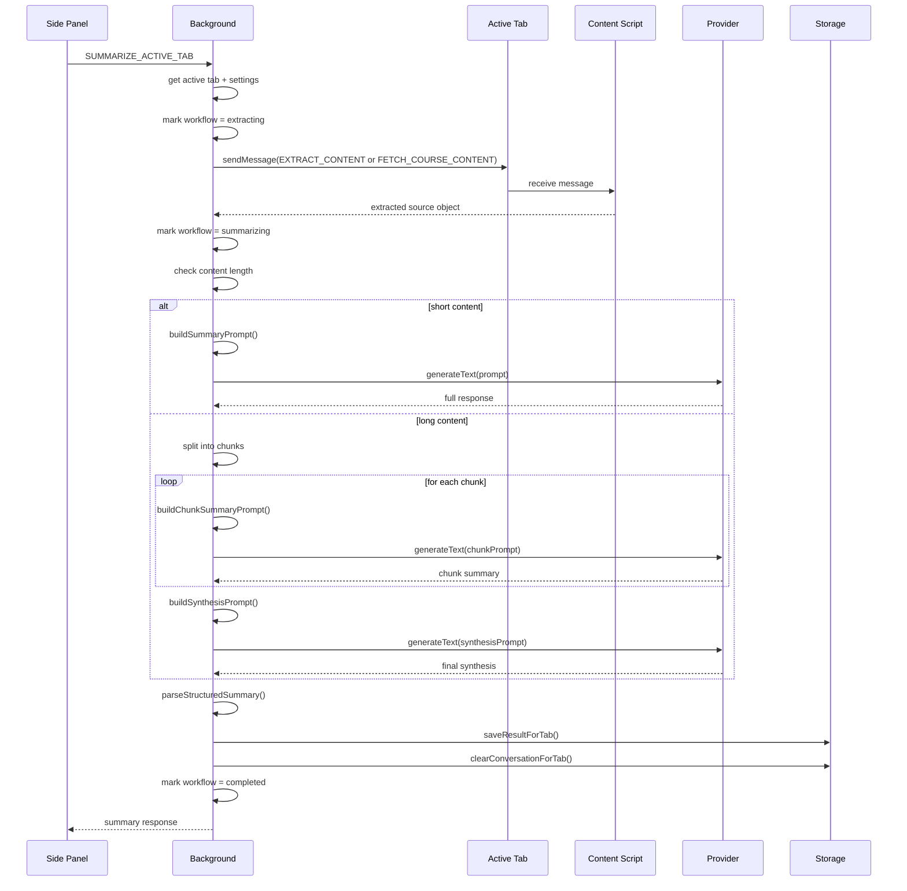
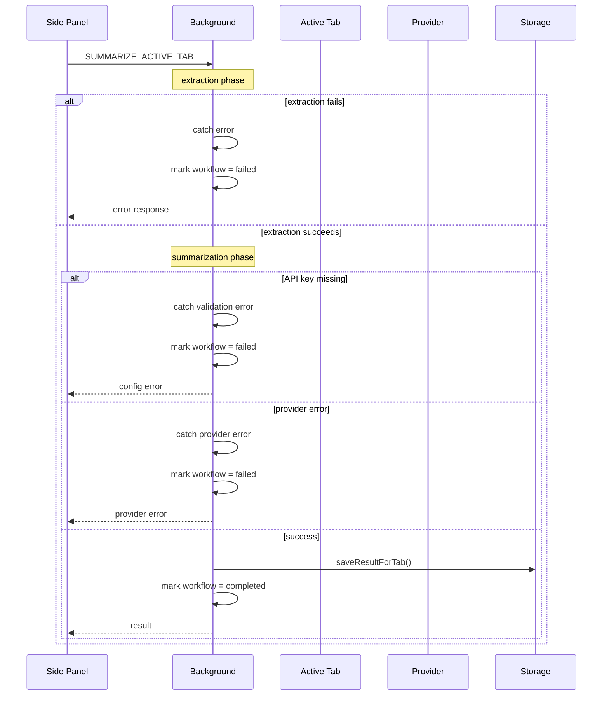
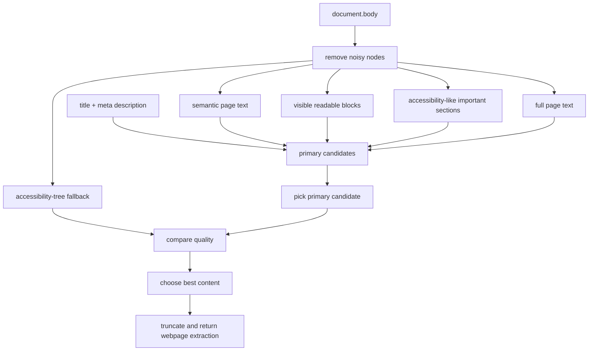
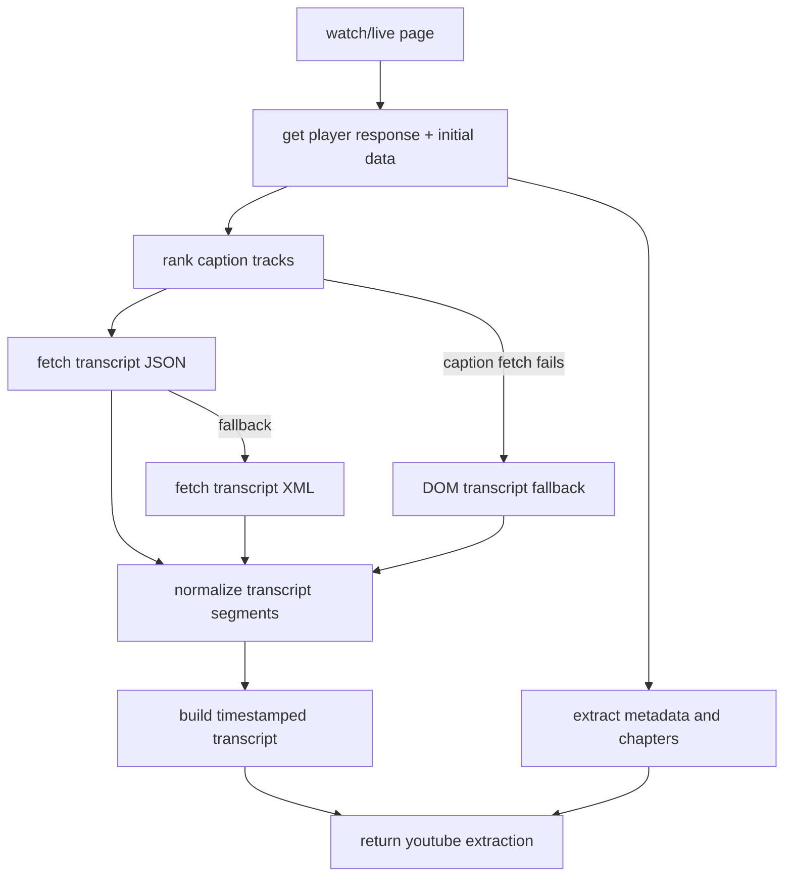
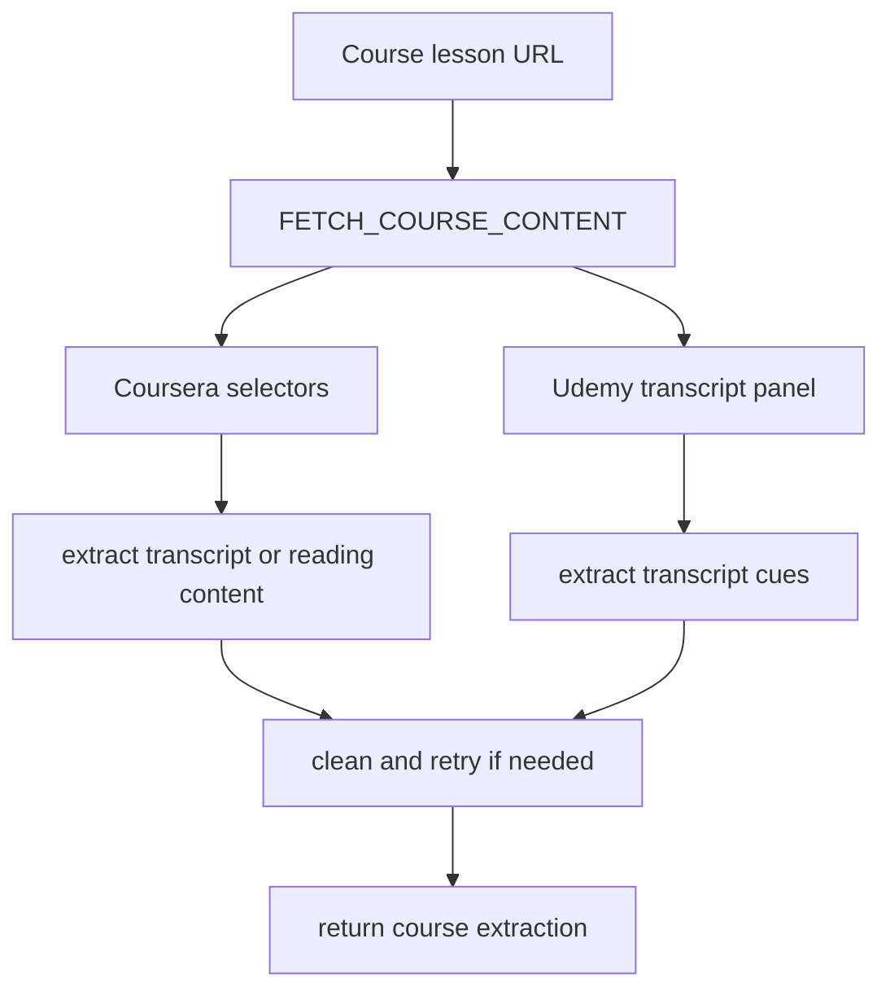
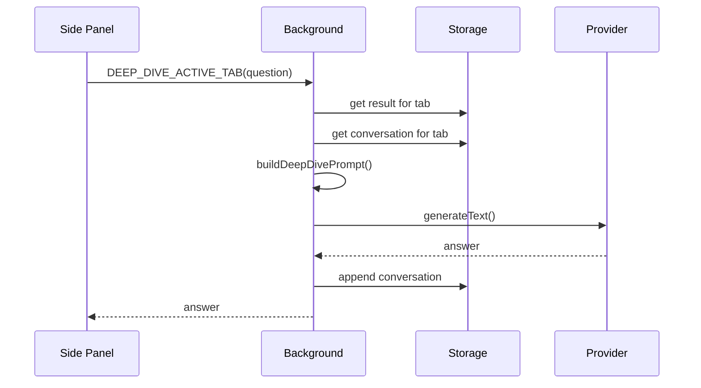
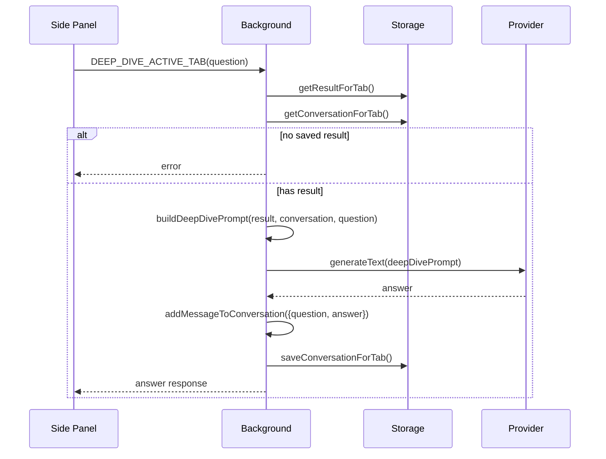

# Workflow

## Summary Generation Flow (Main Path)



## Error Handling Flow



## Workflow Phases

Workflow state is stored per tab and tracks the current phase:

- **`extracting`** - Content is being retrieved from the page
- **`summarizing`** - Content is being sent to the LLM provider
- **`completed`** - Summary generation succeeded, result is saved
- **`failed`** - An error occurred during extraction or summarization

The workflow state also includes:
- `tabId` - which tab this workflow is for
- `updatedAt` - ISO timestamp of last phase change

Phase transitions:
```
not-set → extracting → summarizing → completed
                           ↓
                        failed (error)
```

## Content Extraction Decision Order

[lib/extractors.js](/lib/extractors.js) checks for content in this priority order:

1. **Selected text** - if user has text selected on the page
2. **YouTube** - if URL matches YouTube watch/live pages
3. **Course** - if URL matches Coursera/Udemy lesson patterns
4. **Webpage** - generic DOM-based extraction as fallback

The background layer ([lib/background/tab-manager.js](/lib/background/tab-manager.js)) can also send `FETCH_COURSE_CONTENT` directly for:

- `udemy.com/course/.../learn/...`
- `coursera.org/learn/.../lecture/...`
- `coursera.org/learn/.../supplement/...`

This direct route bypasses the generic extraction dispatcher and goes straight to course-specific handling.

## Webpage Flow



## YouTube Flow



## Course Flow



## Deep-Dive Flow



## Request Strategy

### Single-Request Path (Most Common)

- YouTube: short/normal transcript (< threshold)
- Webpage: normal-sized articles, docs, blogs
- Course: typical lesson pages
- Selected text: any selection

### Multi-Request Path (Long Content)

For very long YouTube transcripts:

1. **Chunk Phase**
   - Split content into chunks (via [lib/background/summary-service.js](/lib/background/summary-service.js))
   - Build chunk-specific prompts for each chunk
   - Send ~2-4 provider requests (one per chunk)
   - Collect chunk summaries

2. **Synthesis Phase**
   - Build synthesis prompt from chunk summaries
   - Send 1 final provider request
   - Parse structured output
   - Save single result with synthesized summary

Total requests: 3-5 depending on content length.

### Provider Request Timeline

```
Single Request:
[extract] ──→ [prompt] ──→ [provider] ──→ [parse] ──→ [save] ─→ [done]
                                (1 req)

Multi Request:
[extract] ──→ [chunks] ──→ [chunk prompts] ──→ [provider] ──→ [synthesis]
                                              (multiple reqs)
                                                      ↓
                                              [provider] (1 more) ──→ [parse] ──→ [save]
```

### Fallback Strategies

**Extraction Fallback (if primary fails):**
- Course extraction fails → webpage extraction
- YouTube transcript fetch fails → DOM scraping
- Webpage semantic extraction fails → accessibility tree fallback

**Provider Fallback:**
- None currently; errors are surfaced to the user for manual retry

## Tab Lifecycle

```
User opens tab
    ↓
[result = null, workflow = null]
    ↓
User summarizes
    ↓
[workflow = extracting]
    ↓
[workflow = summarizing]
    ↓
[result = {...}, workflow = completed]
    ↓
User clicks "Clear"
    ↓
[result = null, conversation = [], workflow = null]
    ↓
User closes tab
    ↓
[all data for tab removed from storage]
```

## Deep-Dive (Follow-Up Q&A) Flow



Deep-dive prompt includes:
- Current summary
- Key takeaways and main points
- Prior expert commentary
- Last 6 messages from conversation history
- Source content (raw and formatted)
- New user question
- Source-specific guidance (YouTube timestamps, course definitions, etc.)
